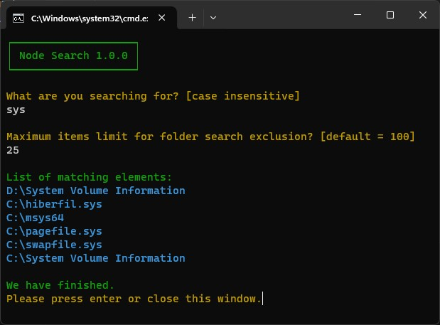

# Node Search

## What is this?

Node Search is a command line tool for performing a fast and complete search of _anything_ in your whole file system.
It currently works only on Windows.

## How can I install it as quickly as possible?

1. If you don't already have it on your system, install Node JS: https://nodejs.org/en/download.
2. Download a copy of this Node Search repository, un-zip it and place it anywhere on your system (it's portable).
3. Double-click on the file "INSTALL DEPENDENCIES.bat", this will download and install the required dependencies.
4. Installation done. You can start searching.

## How do I search as quickly as possible?

1. Double-click on the file "NODE SEARCH WIN.bat".
2. Follow the instructions that appear on the terminal window.

## Example

In the following simple example:
- The user wants to search for the word 'sys.'
- The user sets the item limit to 25.
- The search returns 6 results.

You can observe that:
- General information is shown in green.
- Instructions are displayed in yellow.
- User inputs are presented in white.
- Results are indicated in blue.

## How can it be faster than the Windows search?

I don't think it really is any faster than the windows search.
But it exploits a few tricks to speed up and simplify the task:
1. **Multithreading with Node's Workers.**
    The main search task is splitted into many simpler search tasks.
    The simpler search tasks are equally distributed to all the CPU cores.
2. **Folders with many elements are ignored.**
    Most of the times you are searching for a file or a folder that you created by yourself.
    You tipically avoid to put too many files inside any folder.
    The search task can ignore paths with more than a certain number of files.
    This 'certain number' defaults to the value '100', but it actually is an arbitrary number that can be chosen before starting the search.
3. **It just searches for the file (or folder) name...**
    It doesn't search for text inside files.

## Potential future developments

- Making Node Search cross-platform.
- Making search task start from a user-requested path.
- Converting this into a library or a module.
- Write some automated tests.